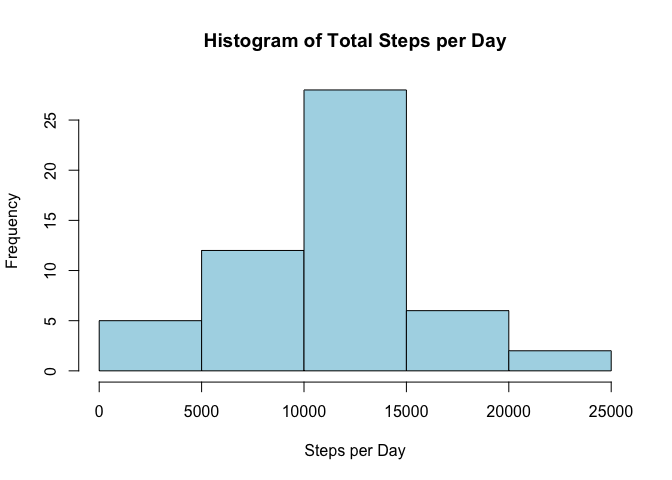
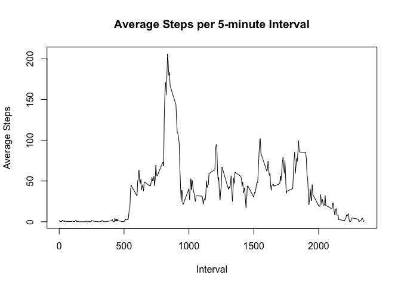
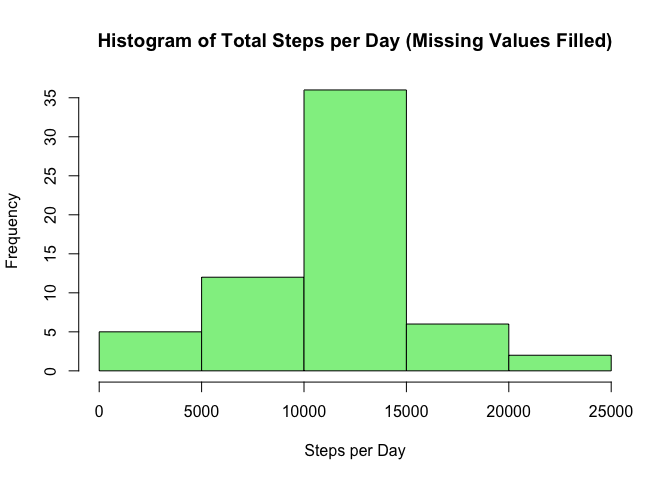
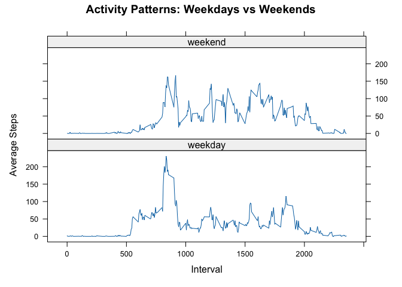

## Loading and preprocessing the data

``` r
# データの読み込みと前処理
activity <- read.csv("activity.csv")
activity$date <- as.Date(activity$date)
```

## What is mean total number of steps taken per day?

``` r
### 1日あたりの合計歩数の計算
daily_steps <- aggregate(steps ~ date, data = activity, sum, na.rm = TRUE)

### ヒストグラムの作成
hist(daily_steps$steps, 
     main = "Histogram of Total Steps per Day",
     xlab = "Steps per Day",
     col = "lightblue")
```

<!-- -->

``` r
### 平均値と中央値の計算
mean_steps <- mean(daily_steps$steps)
median_steps <- median(daily_steps$steps)
print(paste("Mean steps per day:", round(mean_steps, 2)))
```

```
## [1] "Mean steps per day: 10766.19"
```

``` r
print(paste("Median steps per day:", round(median_steps, 2)))
```

```
## [1] "Median steps per day: 10765"
```

## What is the average daily activity pattern?

``` r
### 5分間隔ごとの平均歩数の時系列プロット
interval_steps <- aggregate(steps ~ interval, data = activity, mean, na.rm = TRUE)
plot(interval_steps$interval, interval_steps$steps, 
     type = "l",
     main = "Average Steps per 5-minute Interval",
     xlab = "Interval",
     ylab = "Average Steps")
```

<!-- -->

``` r
### 最大歩数の間隔を特定
max_interval <- interval_steps$interval[which.max(interval_steps$steps)]
print(paste("Interval with maximum steps:", max_interval))
```

```
## [1] "Interval with maximum steps: 835"
```

## Imputing missing values

``` r
### 欠損値の数をカウント
na_count <- sum(is.na(activity$steps))
print(paste("Number of missing values:", na_count))
```

```
## [1] "Number of missing values: 2304"
```

``` r
### 欠損値の補完
activity_filled <- activity
for(i in 1:nrow(activity_filled)) {
    if(is.na(activity_filled$steps[i])) {
        interval_mean <- interval_steps$steps[interval_steps$interval == activity_filled$interval[i]]
        activity_filled$steps[i] <- interval_mean
    }
}

### 補完後のデータで1日あたりの合計歩数を計算
daily_steps_filled <- aggregate(steps ~ date, data = activity_filled, sum)
hist(daily_steps_filled$steps,
     main = "Histogram of Total Steps per Day (Missing Values Filled)",
     xlab = "Steps per Day",
     col = "lightgreen")
```

<!-- -->

## Are there differences in activity patterns between weekdays and weekends?

``` r
### 平日/週末の分類
activity_filled$day_type <- ifelse(weekdays(activity_filled$date) %in% 
                                  c("Saturday", "Sunday"), "weekend", "weekday")
activity_filled$day_type <- factor(activity_filled$day_type)

### 平日/週末別の時系列プロット
library(lattice)
interval_steps_by_day <- aggregate(steps ~ interval + day_type, 
                                 data = activity_filled, 
                                 mean)

xyplot(steps ~ interval | day_type, 
       data = interval_steps_by_day,
       type = "l",
       layout = c(1, 2),
       xlab = "Interval",
       ylab = "Average Steps",
       main = "Activity Patterns: Weekdays vs Weekends")
```

<!-- -->
